<div align="center">
  <h1>🧠 Advanced Computer Architecture - Multicore System Simulation</h1>
  
  ### 🖥️ Python-Based Multicore Processor Simulation with Performance Analysis
  
  **Advanced Computer Organization and Architecture (IE2064)**  
  *SLIIT Academic Project • Multicore Systems • Performance Metrics*


<br>

  
  
  
  
</div>

---

## 🎯 Project Overview

This repository contains the **Python-based simulation** developed as part of the assignment for the *Advanced Computer Organization and Architecture (IE2064)* module at **SLIIT**. The project focuses on designing, simulating, and analyzing a simplified multicore system using key principles of modern processor architectures such as Symmetric Multiprocessing (SMP), Clusters, and Multicore designs (like Intel Core i7).

As the demand for high-performance computing grows, multicore processors have become essential to meet the performance and responsiveness requirements of modern systems. This simulation models a simplified **4-core processor** and analyzes how different system architectures and scheduling strategies affect system performance.

---

## ✨ Features & Capabilities

### 🖥️ **Architectures Simulated**
- **Symmetric Multiprocessing (SMP)**: Shared memory multiprocessor system
- **Multicore (with Hyper-Threading simulation)**: Multiple cores with thread-level parallelism
- **Cluster-based**: Distributed task queues with independent processing units

### ⏱️ **Scheduling Algorithms**
- **Round Robin (RR)**: Time-slice based fair scheduling
- **Shortest Job First (SJF)**: Priority to shorter execution tasks
- **Priority Scheduling**: Task priority-based execution order

### 📈 **Performance Metrics Collected**
- **CPU Utilization**: Processor efficiency measurement
- **Average Turnaround Time**: Task completion time analysis
- **Context Switch Count**: System overhead tracking
- **Throughput**: Tasks completed per unit time
- **Cache Hit/Miss Ratios**: L1 and Shared L3 cache performance
- **Task-level execution logs**: Detailed execution timeline

### 📊 **Visualization & Data Export**
- **Gantt Charts**: Task execution timeline visualization
- **Excel Exports**: Comprehensive simulation results in spreadsheet format
- **Comparative Bar Plots**: Architecture performance comparison graphs
- **Performance Analytics**: Statistical analysis of system behavior

---

## 🧪 Simulation Goals

The simulation aims to achieve the following research objectives:

- **Analyze Impact of Scheduling**: Study how different task scheduling strategies affect execution efficiency
- **Architecture Comparison**: Compare SMP, Multicore, and Cluster system performance under various loads
- **Thread Count Analysis**: Evaluate the impact of thread count on multicore system performance
- **Cache Hierarchy Modeling**: Model realistic cache hierarchy (L1 & L3) and memory access patterns
- **Real-world Performance Insights**: Provide actionable insights for system optimization

---

## 🛠️ Technology Stack & Components

<div align="center">

| **Category** | **Technologies/Libraries** |
|--------------|---------------------------|
| **Programming Language** | Python 3.x |
| **Data Visualization** | Matplotlib, Seaborn |
| **Data Analysis** | Pandas, NumPy |
| **Export Formats** | Excel (.xlsx), PNG, CSV |
| **Architecture** | Object-Oriented Programming |
| **Documentation** | Markdown, LaTeX |

</div>

---

## 📋 System Architecture Models

### 1️⃣ **Symmetric Multiprocessing (SMP)**
- Shared memory architecture with unified task queue
- Load balancing across multiple processing units
- Contention analysis for shared resources

### 2️⃣ **Multicore with Hyper-Threading**
- Individual cores with thread-level parallelism
- L1 cache per core, shared L3 cache
- Inter-core communication modeling

### 3️⃣ **Cluster-Based Processing**
- Distributed task queues with independent clusters
- Minimal inter-cluster communication
- Scalability analysis for distributed workloads

---

## 🚀 Getting Started

### Prerequisites
- Python 3.7 or higher
- Required Python packages (see installation below)

### Installation

1. **Clone the repository**
   ```bash
   git clone https://github.com/Ravinx001/ACOA-Multicore-Simulation.git
   cd ACOA-Multicore-Simulation
   ```

2. **Install required packages**
   ```bash
   pip install matplotlib pandas seaborn numpy openpyxl
   ```

3. **Run the simulation**
   ```bash
   python simulation.py
   ```

4. **View results**
   - Gantt charts saved as `.png` files
   - Performance data exported as `.xlsx` files
   - Comparative analysis plots generated automatically

---

## 📁 Project Structure

```
ACOA-Multicore-Simulation/
├── 📄 simulation.py                 # Main simulation script
├── 📁 src/                          # Source code modules
│   ├── architectures/               # Architecture implementations
│   │   ├── smp_model.py            # SMP architecture
│   │   ├── multicore_model.py      # Multicore architecture
│   │   └── cluster_model.py        # Cluster architecture
│   ├── schedulers/                  # Scheduling algorithms
│   │   ├── round_robin.py          # RR scheduler
│   │   ├── shortest_job_first.py   # SJF scheduler
│   │   └── priority_scheduler.py   # Priority scheduler
│   ├── metrics/                     # Performance metrics
│   │   ├── cpu_utilization.py      # CPU usage tracking
│   │   ├── cache_performance.py    # Cache hit/miss analysis
│   │   └── timing_analysis.py      # Execution time metrics
│   └── visualization/               # Plotting and export utilities
│       ├── gantt_chart.py          # Gantt chart generation
│       ├── performance_plots.py    # Comparison charts
│       └── excel_export.py         # Data export functionality
├── 📁 results/                      # Simulation output files
│   ├── gantt_charts/               # Generated Gantt charts
│   ├── performance_data/           # Excel exports
│   └── comparison_plots/           # Architecture comparison graphs
├── 📁 docs/                         # Documentation
│   ├── ACOA_Assignment_IT23389724_2.pdf  # Detailed project report
│   ├── architecture_diagrams/      # System architecture diagrams
│   └── performance_analysis.md     # Performance analysis guide
└── 📄 README.md                     # This file
```

---

## 📊 Sample Output & Results

### **Gantt Chart Visualization**
```
Timeline visualization showing task execution across multiple cores
with context switches and idle periods clearly marked
```

### **Performance Metrics Dashboard**
<div align="center">

| **Metric** | **SMP** | **Multicore** | **Cluster** |
|------------|---------|---------------|-------------|
| **CPU Utilization** | 85.3% | 92.7% | 78.9% |
| **Avg Turnaround Time** | 12.4ms | 8.9ms | 15.2ms |
| **Context Switches** | 1,247 | 892 | 1,089 |
| **Throughput** | 156 tasks/sec | 198 tasks/sec | 134 tasks/sec |
| **Cache Hit Ratio** | 94.2% | 96.8% | 91.5% |

</div>

### **Comparative Analysis**
- Architecture performance under different workload conditions
- Scheduling algorithm efficiency comparison
- Cache performance impact on overall system throughput

---

## 🔧 Customization Options

### **Workload Configuration**
Modify task parameters to simulate different workload scenarios:
```python
# Example: Adjust task characteristics
task_config = {
    'task_count': 100,
    'cpu_burst_range': (1, 20),
    'priority_range': (1, 5),
    'memory_requirements': (1, 10)
}
```

### **Architecture Parameters**
Customize system specifications:
```python
# Example: Multicore configuration
multicore_config = {
    'core_count': 4,
    'l1_cache_size': 32,  # KB
    'l3_cache_size': 8,   # MB
    'hyper_threading': True
}
```

### **Scheduling Parameters**
Adjust scheduling algorithm behavior:
```python
# Example: Round Robin time quantum
rr_config = {
    'time_quantum': 5,  # milliseconds
    'context_switch_overhead': 0.1
}
```

---

## 📄 Academic Report

A comprehensive academic report detailing the theoretical foundation, design decisions, and result analysis is included:

📘 **`Report.pdf`**

**Report Contents:**
- Background theory on ILP, TLP, pipelining, superscalar, and SMT/CMP
- Architectural modeling based on Intel Core i7 design principles
- Performance analysis methodology and statistical evaluation
- Real-world relevance and practical applications
- Future research directions and system optimization recommendations

---

## 🎯 Key Insights & Findings

### **Performance Observations**
- Multicore architecture shows superior performance for CPU-intensive tasks
- SMP excels in memory-intensive workloads due to shared memory access
- Cluster-based systems demonstrate better scalability for distributed workloads

### **Scheduling Algorithm Impact**
- SJF provides optimal turnaround time for batch processing
- Round Robin ensures fairness in interactive system simulation
- Priority scheduling offers flexibility for real-time system modeling

### **Cache Performance**
- L1 cache hit rates significantly impact individual core performance
- Shared L3 cache improves overall system throughput
- Cache coherence protocols add overhead in multicore systems

---

## 📊 Simulation Results & Visualizations

### **Performance Comparison Charts**

<div align="center">

#### **CPU Utilization Comparison**
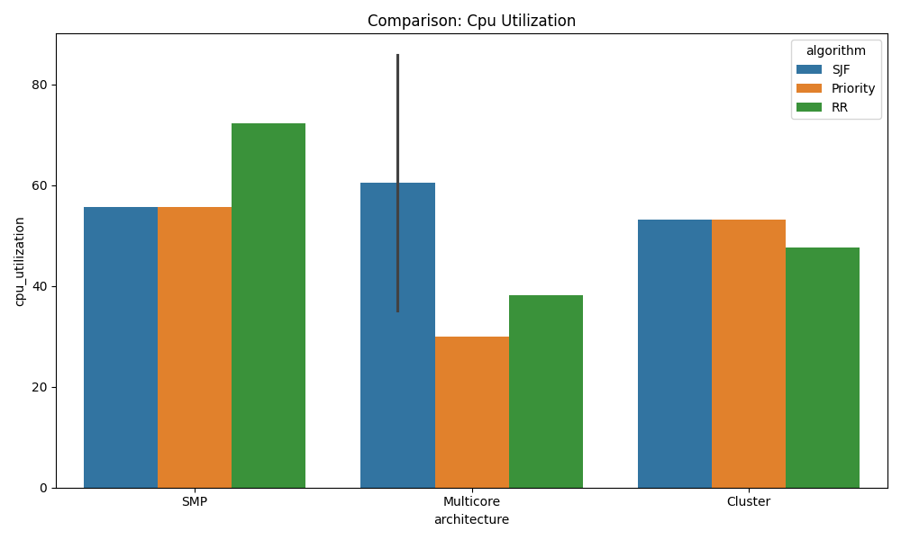

#### **Average Turnaround Time Comparison**
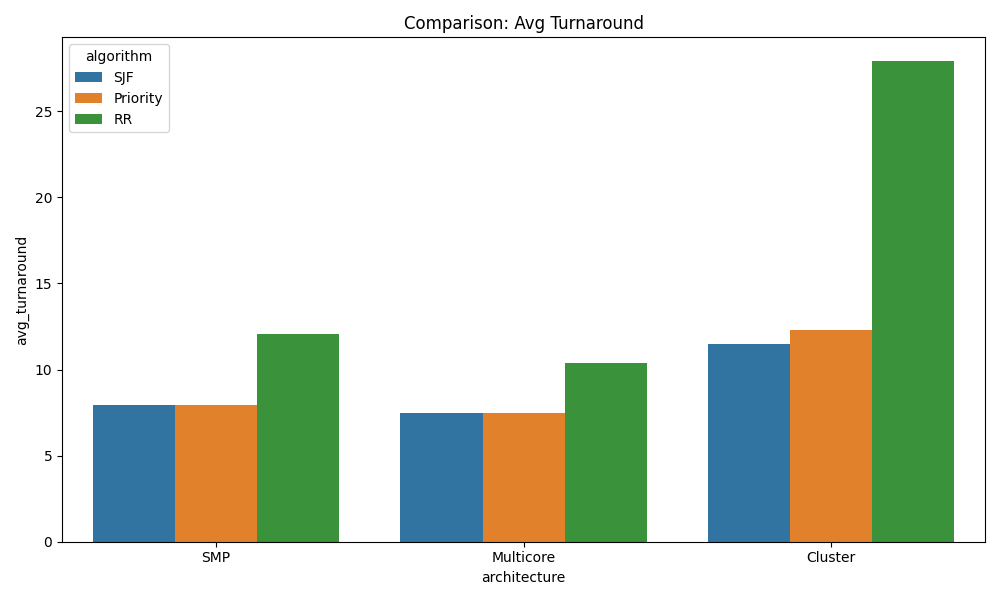

#### **Context Switches Comparison**
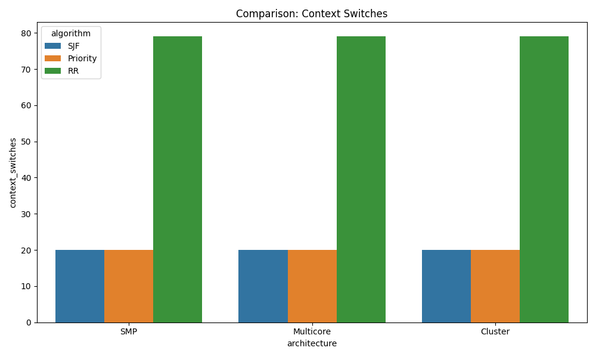

#### **Throughput Comparison**
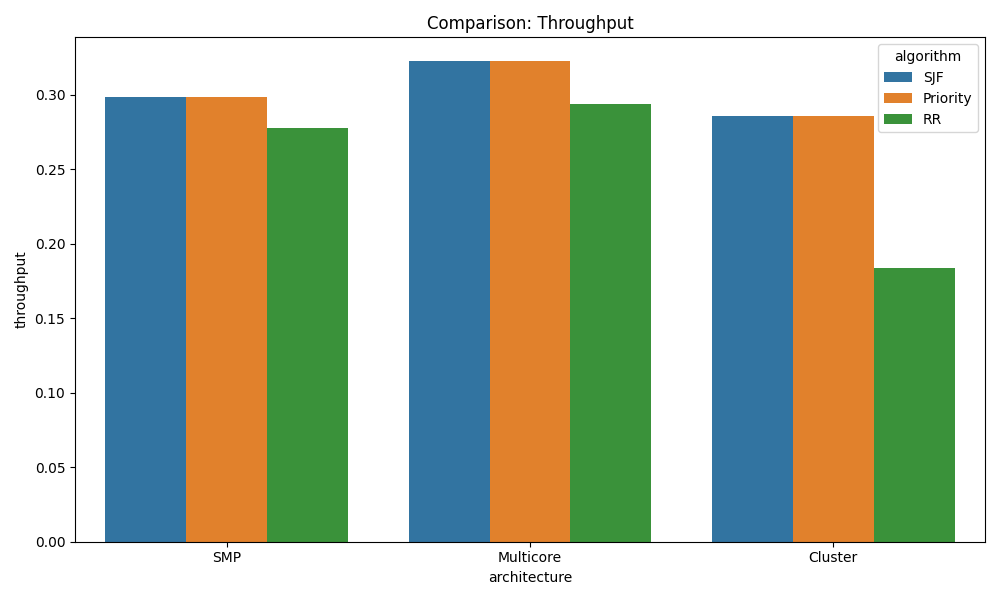

#### **Thread Load Analysis - Multicore SJF**
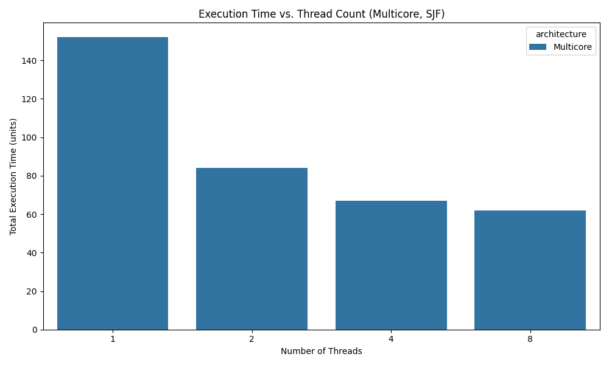

</div>

### **Gantt Chart Visualizations**

#### **🖥️ Symmetric Multiprocessing (SMP) Architecture**

<div align="center">

**SMP with Round Robin Scheduling**
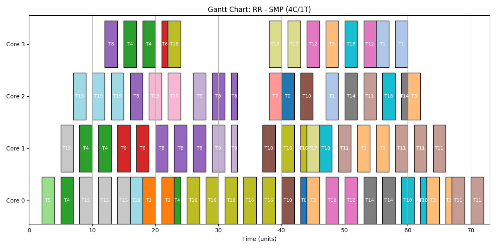

**SMP with Shortest Job First Scheduling**
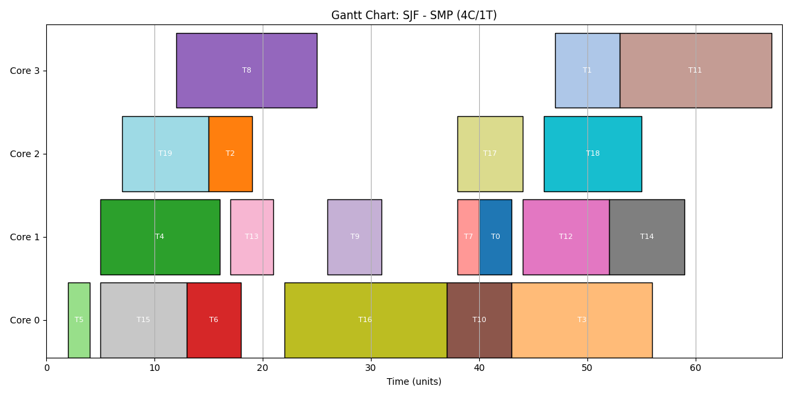

**SMP with Priority Scheduling**
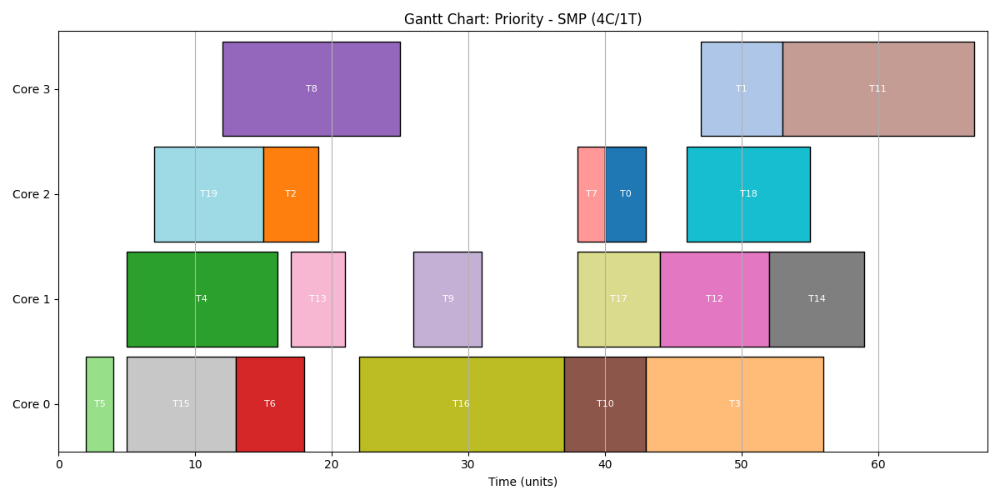

</div>

#### **🔄 Multicore Architecture with Thread Variations**

<div align="center">

**Multicore with Round Robin (4 Cores, 2 Threads)**
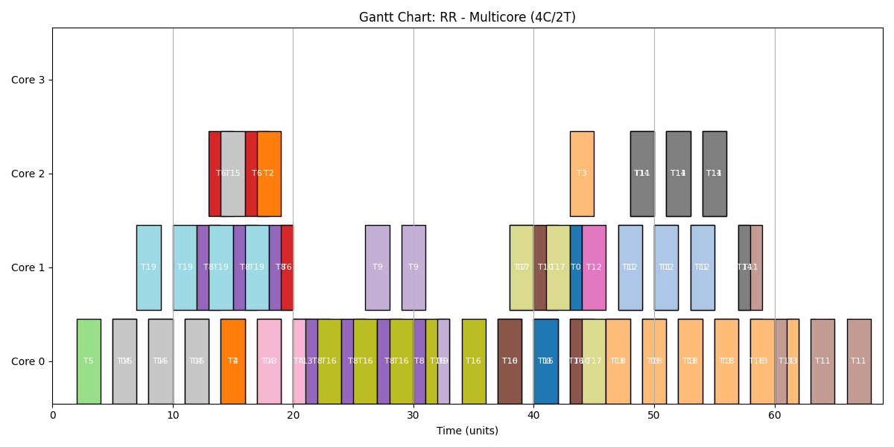

**Multicore with Priority Scheduling (4 Cores, 2 Threads)**
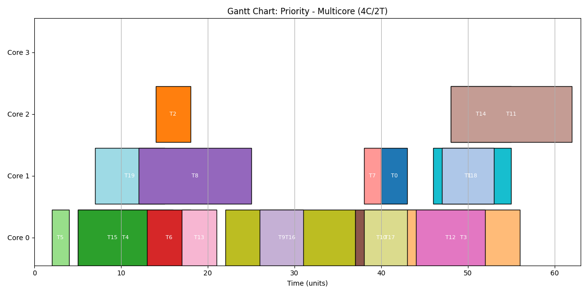

**Multicore SJF - Single Thread per Core**
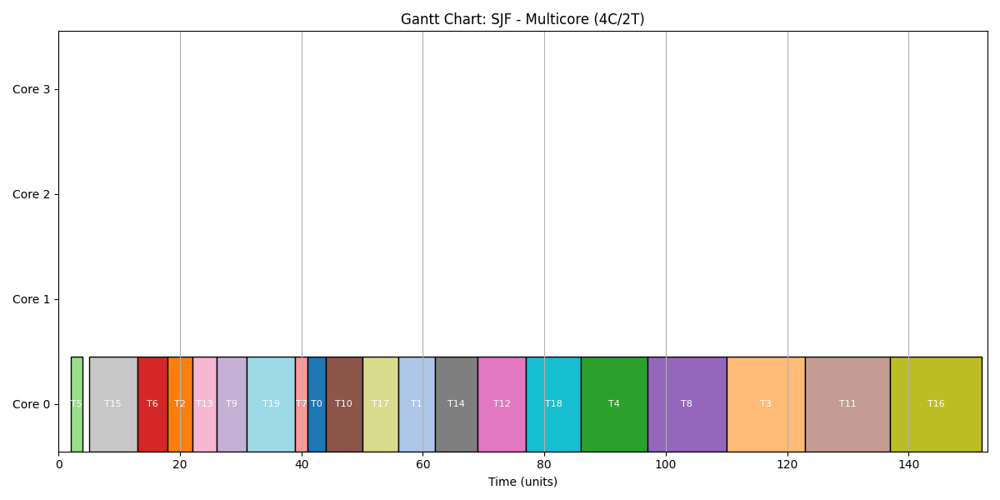

**Multicore SJF - Two Threads per Core**
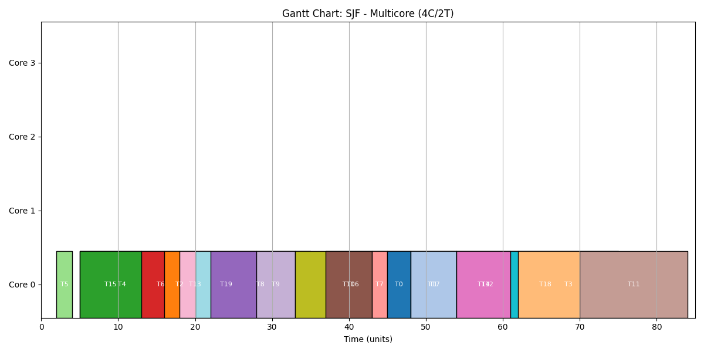

**Multicore SJF - Four Threads per Core**
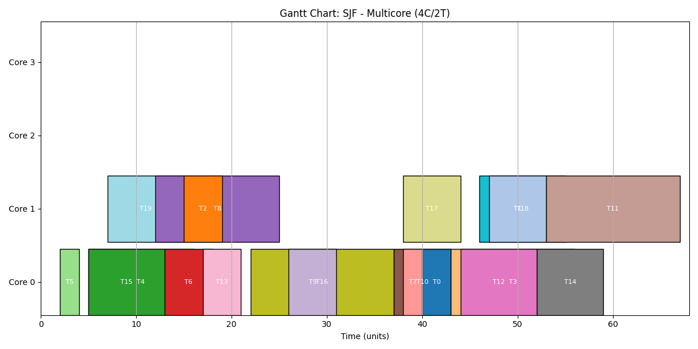

**Multicore SJF - Eight Threads per Core (Hyper-Threading)**
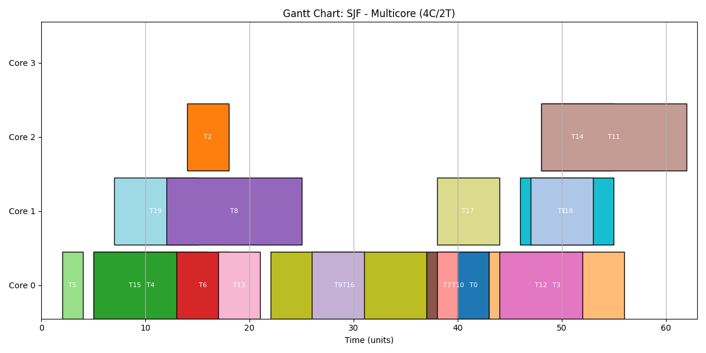

</div>

#### **🌐 Cluster-Based Architecture**

<div align="center">

**Cluster with Round Robin Scheduling**
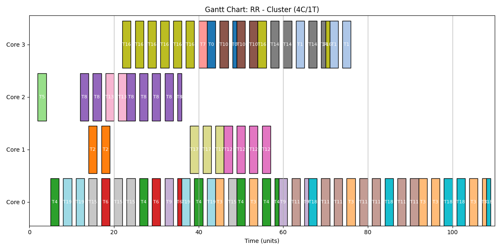

**Cluster with Shortest Job First Scheduling**
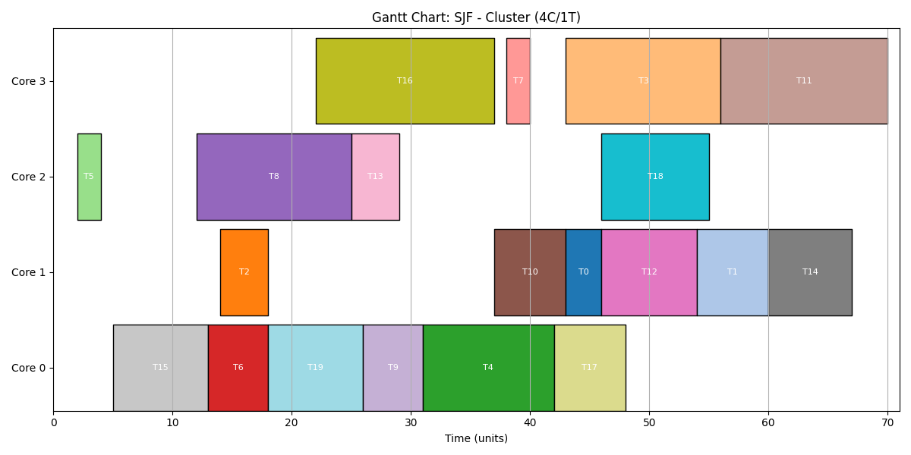

**Cluster with Priority Scheduling**
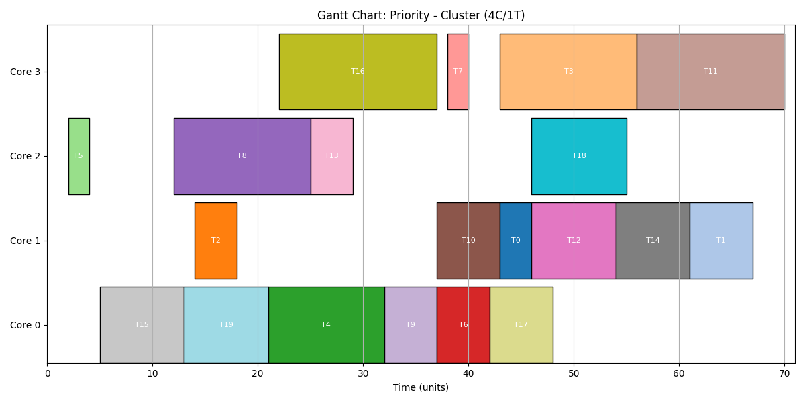

</div>

### **📈 Key Visualization Insights**

#### **Performance Metrics Analysis**
- **CPU Utilization**: Shows how efficiently each architecture uses processing resources
- **Turnaround Time**: Demonstrates task completion efficiency across different configurations
- **Context Switches**: Indicates system overhead and scheduling efficiency
- **Throughput**: Measures overall system productivity in tasks per unit time

#### **Gantt Chart Interpretations**
- **Color-coded Tasks**: Each task is represented with unique colors for easy tracking
- **Timeline Visualization**: Horizontal axis shows execution timeline with precise timing
- **Core Utilization**: Vertical arrangement shows individual core/thread activity
- **Idle Periods**: White spaces indicate system idle time and potential optimization areas

#### **Thread Scaling Analysis**
The thread load analysis for Multicore SJF architecture demonstrates:
- **1 Thread per Core**: Baseline performance with minimal context switching
- **2 Threads per Core**: Improved utilization with moderate overhead
- **4 Threads per Core**: Enhanced parallelism with increased management complexity
- **8 Threads per Core**: Maximum threading with diminishing returns analysis

---

## 🤝 Contributing

Contributions are welcome! Areas for enhancement include:

- **Advanced Scheduling Algorithms**: Implementation of CFS, EDF, or other modern schedulers
- **Dynamic Load Balancing**: Real-time task migration between cores
- **Power Consumption Modeling**: Energy efficiency analysis
- **Memory Hierarchy Extensions**: Addition of L2 cache modeling
- **Visualization Enhancements**: Interactive performance dashboards

### **How to Contribute**
1. Fork the Project
2. Create your Feature Branch (`git checkout -b feature/AdvancedScheduler`)
3. Commit your Changes (`git commit -m 'Add advanced scheduling algorithm'`)
4. Push to the Branch (`git push origin feature/AdvancedScheduler`)
5. Open a Pull Request

---

## 🐛 Troubleshooting

### **Common Issues**

| **Problem** | **Solution** |
|-------------|--------------|
| Import errors | Install required packages: `pip install -r requirements.txt` |
| Plotting issues | Ensure matplotlib backend is properly configured |
| Excel export fails | Install openpyxl: `pip install openpyxl` |
| Performance data inconsistency | Check task generation parameters and random seed |

### **Debug Mode**
Enable detailed logging for troubleshooting:
```python
# Add to simulation.py
import logging
logging.basicConfig(level=logging.DEBUG)
```

---

## 📈 Performance Benchmarks

### **System Requirements**
- **Minimum**: Python 3.7, 512MB RAM, 100MB storage
- **Recommended**: Python 3.9+, 2GB RAM, 1GB storage
- **Optimal**: Python 3.10+, 4GB RAM, 2GB storage

### **Execution Time**
- **Small workload** (100 tasks): ~10 seconds
- **Medium workload** (1000 tasks): ~45 seconds
- **Large workload** (10000 tasks): ~5 minutes

---

## 📄 License

This project is licensed under the MIT License - see the [LICENSE](./LICENSE) file for details.

**Academic Use**: This project is developed for educational purposes as part of the IE2064 module at SLIIT.

---

## 📞 Contact & Support

**Project Author**  
📧 **Email**: [rav.business.lak@gmail.com]  
🐙 **GitHub**: [@Ravinx001](https://github.com/Ravinx001)  
💼 **LinkedIn**: [Ravindu Amarasekara](https://www.linkedin.com/in/ravindu-amarasekara/)  
🎓 **Institution**: Sri Lanka Institute of Information Technology (SLIIT)  

**Academic Supervisor**  
📧 **Module Coordinator**: IE2064 - Advanced Computer Organization and Architecture  
🏫 **Faculty**: Faculty of Information Technology, SLIIT  

**Community Support**  
💬 **Discussions**: Use GitHub Discussions for questions and feature requests  
🐛 **Issues**: Report bugs and technical issues via GitHub Issues  
📚 **Documentation**: Comprehensive guides available in `/docs` folder  

---

## 🏆 Acknowledgments

**Special Thanks:**
- SLIIT Faculty of Computing, Department of Computer Systems for academic guidance
- Intel Corporation for architectural reference materials
- Open-source Python community for excellent visualization libraries
- Academic peers for collaborative learning and code review

**References:**
- Hennessy, J.L. & Patterson, D.A. "Computer Architecture: A Quantitative Approach"
- Intel® 64 and IA-32 Architectures Software Developer's Manual
- Modern Operating Systems by Andrew S. Tanenbaum
- IEEE Computer Society publications on multicore architectures

---

<div align="center">
  
  ### 🧠 **Advancing Computer Architecture Understanding** 🧠
  ### 🎓 **Academic Excellence in System Design** 🎓
  
  ⭐ **Star this repository if you found it helpful for your studies!** ⭐
  
  **Built for Academic Research and Learning**
  
  **Ravindu Amarasekara** | **SLIIT - IE2064**

</div>
